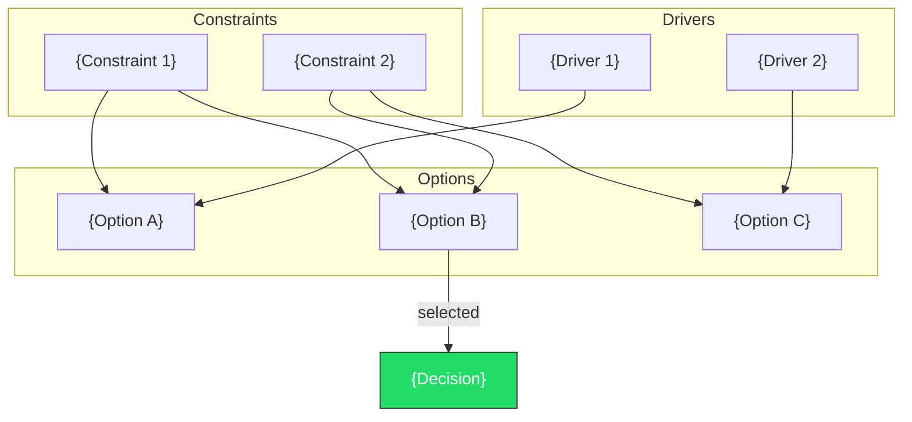
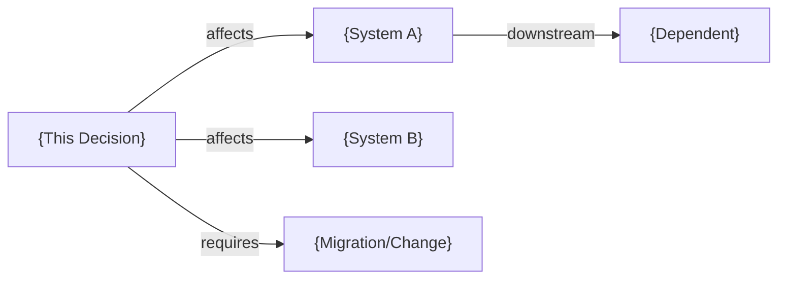

# ADR-{number}: {title}

## Status
{Proposed | Accepted | Deprecated | Superseded}

## Context

{Why this decision needs to be made — the forces at play}

### Decision Context

## Decision
{What we decided and why}

## Consequences

### Positive
- {benefit}

### Negative
- {trade-off}

### Risks
- {risk}: {mitigation}

## Alternatives Considered
| Option | Pros | Cons | Rejected Because |
|--------|------|------|-----------------|
| {A} | ... | ... | ... |
| {B} | ... | ... | ... |

## Implementation Impact

## Related
- Supersedes: {ADR-NNN if applicable}
- Related to: {ADR-NNN if applicable}
- Specs: `docs/specs/{path}/`

---
*Generated by Claude 一人公司 — Architecture Decision Record*
