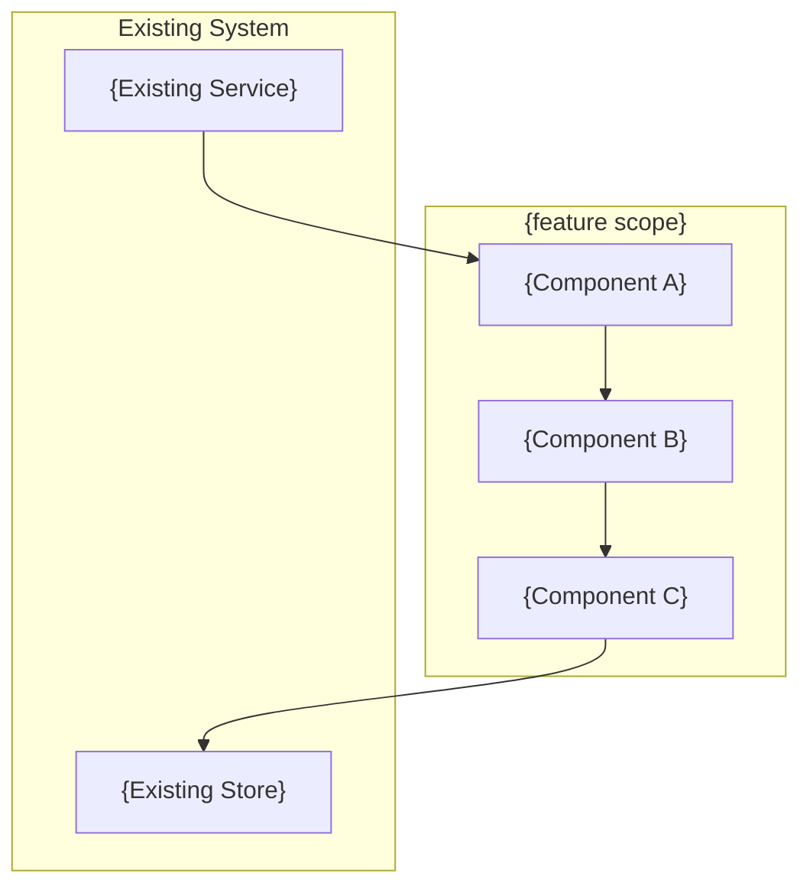
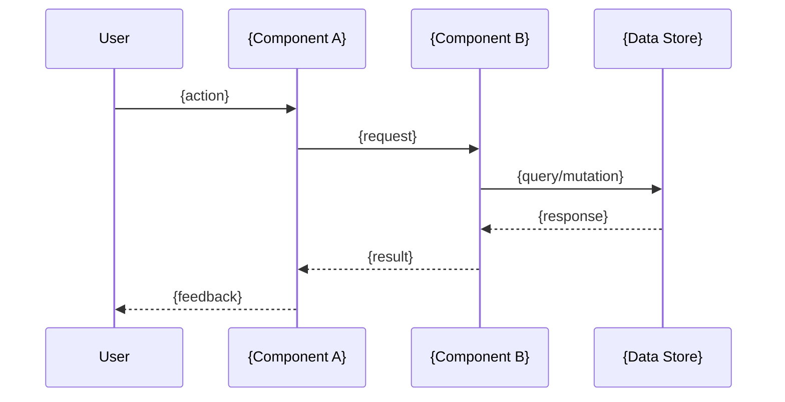
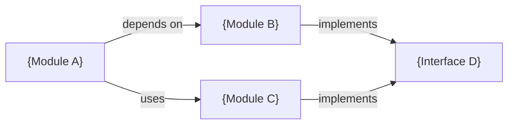

# Design: {feature name}

## Architecture Diagram

## Codebase Analysis
{Relevant existing patterns, files, and conventions discovered during codebase scan}

## Proposed Approach
{Recommended architecture with rationale}

## Data Flow

## Component Relationships

### Alternatives Considered
| Approach | Pros | Cons | Rejected Because |
|----------|------|------|-----------------|
| {A} | ... | ... | ... |
| {B} | ... | ... | ... |

## Key Decisions
- {Decision 1}: {choice} — because {rationale}
- {Decision 2}: {choice} — because {rationale}

## Dependencies & Risks
| Risk | Likelihood | Impact | Mitigation |
|------|-----------|--------|------------|
| {Risk 1} | low/med/high | low/med/high | {mitigation} |

## Files Affected
- `{path}` — {what changes and why}

---
*Generated by Claude 一人公司 — pipeline Stage 2: Design*
